# CineBook — Angular Movie Ticket Booking

CineBook is a full-stack movie ticket booking application built with **Angular** on the frontend and **ASP.NET Core Web API + SQL Server** on the backend.

The UI is designed around a simple cinema workflow: discover movies → open details → select a show → choose seats → book tickets → review booking history.

## UI Preview

### Admin Dashboard
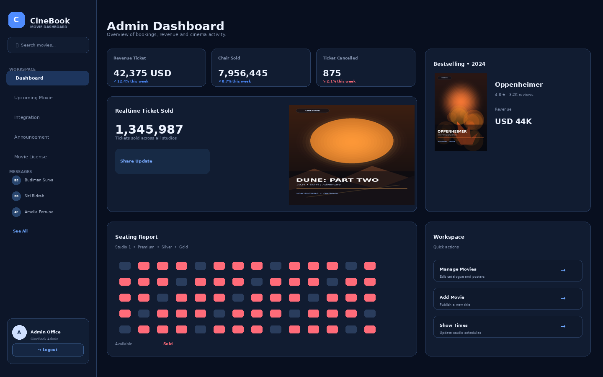

### User Login
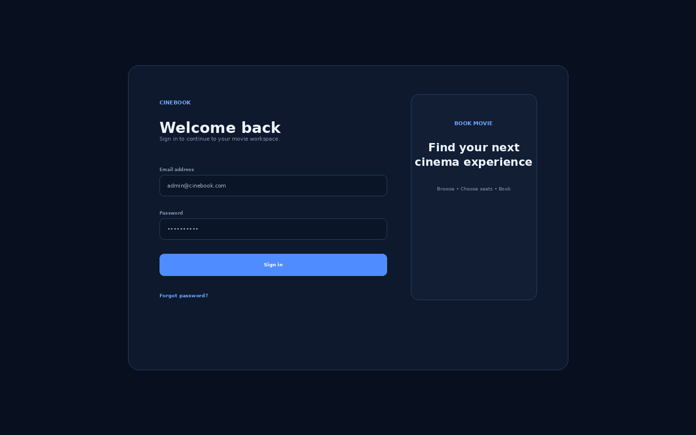

### Home / Movie Dashboard
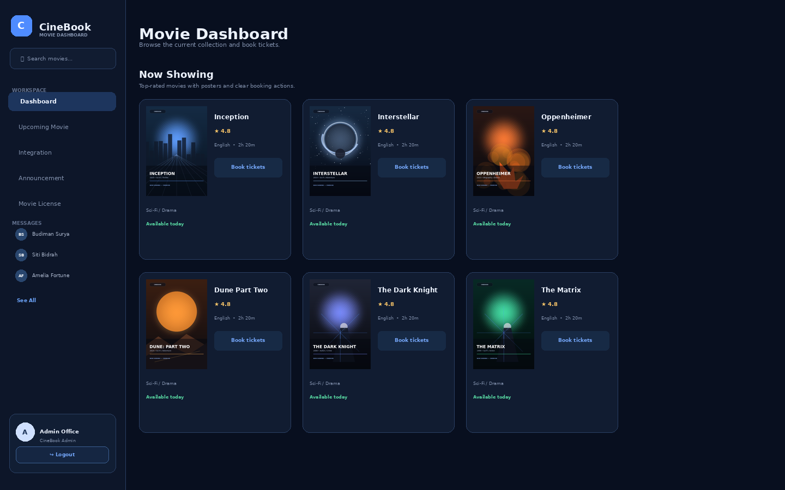

### Top Movies
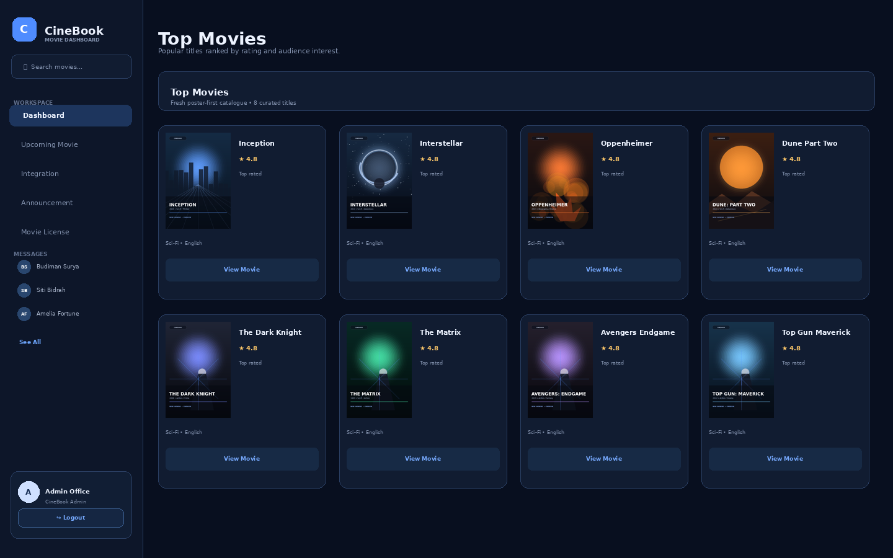

### Movie Details
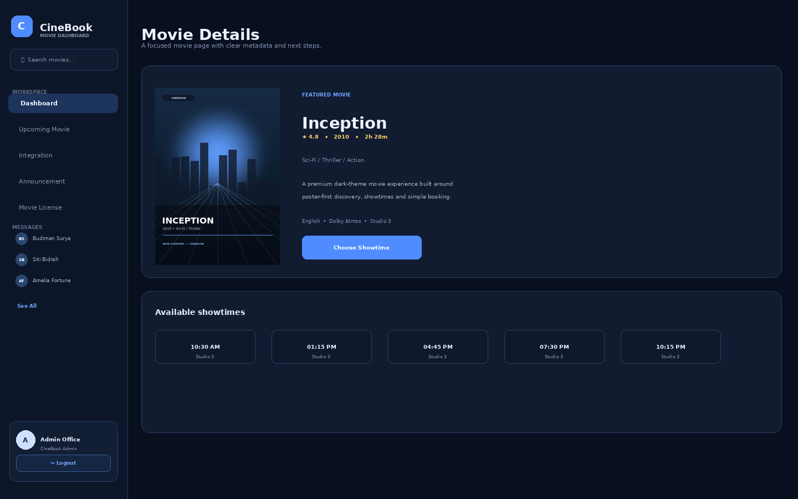

### Show Times
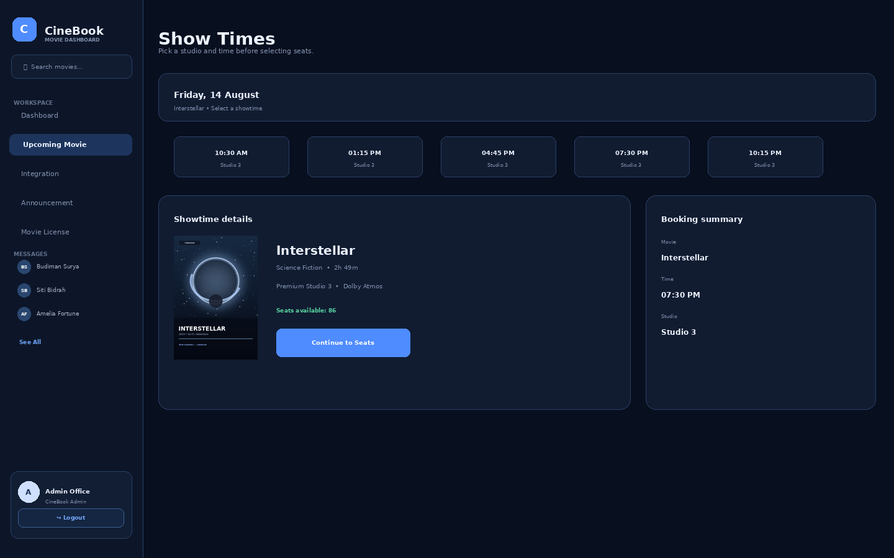

### Seat Selection
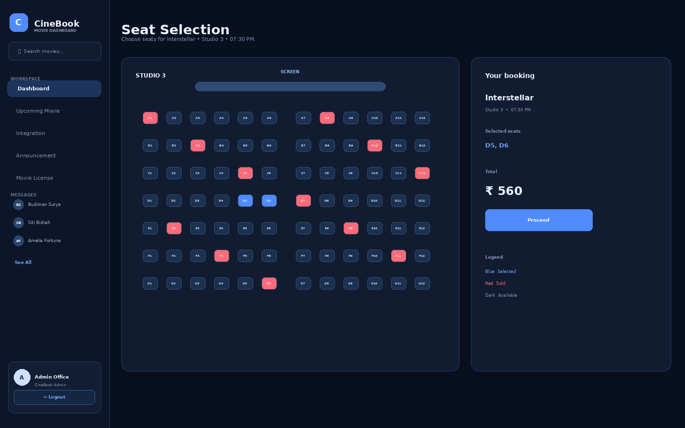

### Booking Confirmation
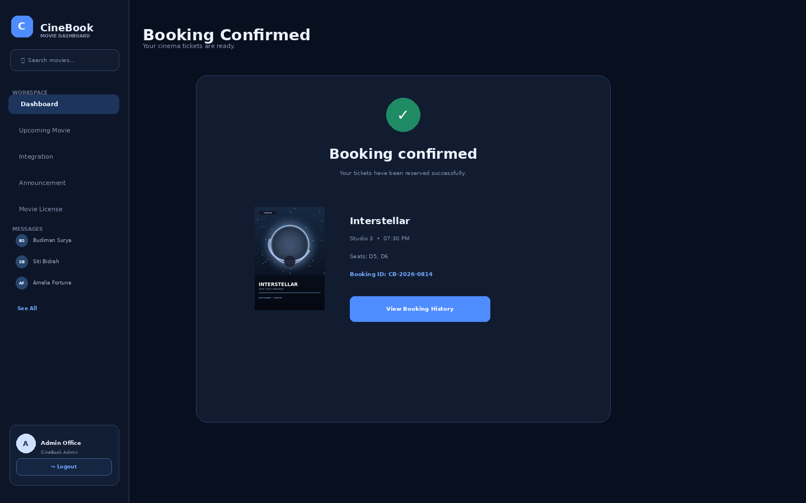

### Booking History
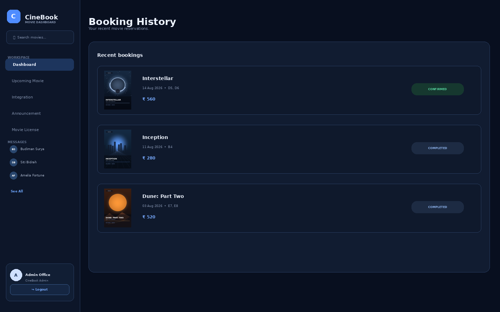

### Admin Movie Management
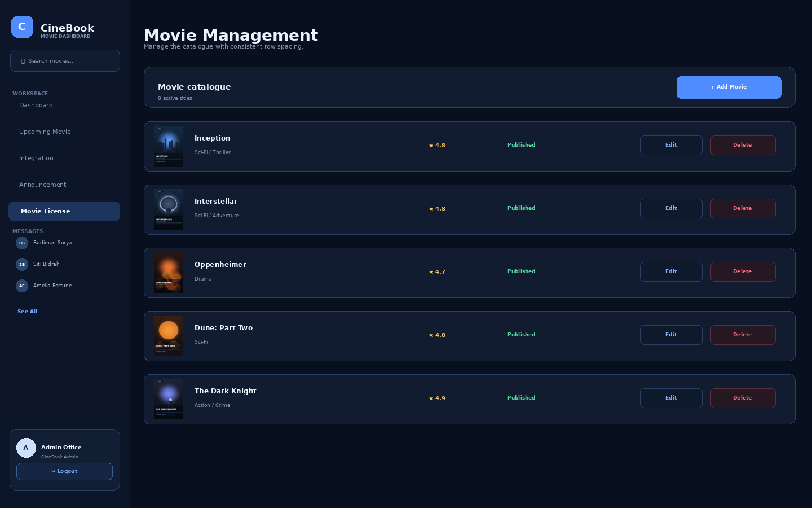

### Add Movie
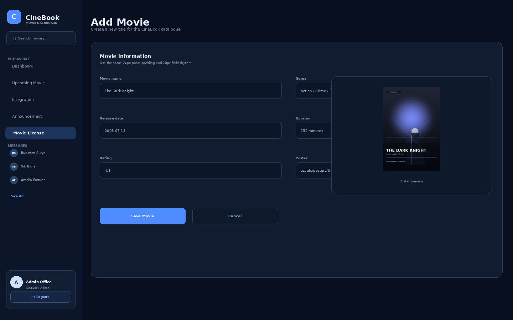

### Reviews
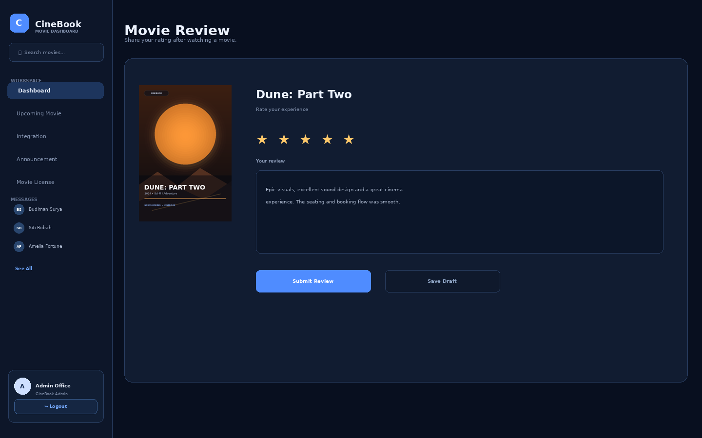

## Features

### User
- Register and sign in
- Browse movie catalog
- Search movies by name
- Filter movies by release date
- View movie details, rating, language, runtime and director
- Browse available show times
- Select seats
- Book tickets
- View booking history
- Submit movie reviews

### Admin
- Add movies
- Edit movie details
- Delete movies
- Manage show times
- View/manage booking data
- Manage the movie catalog through the API

### Backend
- ASP.NET Core Web API
- Entity Framework Core
- SQL Server
- JWT authentication
- ASP.NET Identity
- Repository / Unit of Work pattern
- AutoMapper
- Swagger API documentation

## Movie Catalog Update

The demo catalog no longer uses **Red Sparrow** as the featured sample movie.

The backend includes a small presentation-ready catalog with recognizable movies such as:
- Inception
- Interstellar
- Oppenheimer
- Dune: Part Two
- Avengers: Endgame
- Spider-Man: Across the Spider-Verse

`MovieCatalogSeeder.cs` keeps existing booking IDs intact when replacing the old Red Sparrow demo record. For a fresh database, it adds the starter catalog automatically.

## Architecture

```text
Angular Client
     |
     | HTTP / JSON + JWT
     v
ASP.NET Core Web API
     |
     +--> Controllers
     |      +-- Movies
     |      +-- ShowTimes
     |      +-- Bookings
     |      +-- Reviews
     |      +-- Users / Authentication
     |
     +--> Services / Repository / Unit of Work
     |
     +--> Entity Framework Core
     |
     v
SQL Server Database
```

## Frontend Structure

```text
MovieFrontEnd/
└── MovieFrontEnd/
    └── src/
        ├── app/
        │   ├── auth/
        │   ├── movie/
        │   │   ├── add-movie/
        │   │   ├── admin-movie-list/
        │   │   ├── edit-movie/
        │   │   ├── movie-card/
        │   │   ├── movie-detail/
        │   │   └── movie-list/
        │   ├── services/
        │   ├── user/
        │   ├── model/
        │   └── nav-bar/
        ├── data/
        ├── environments/
        └── styles.css
```

## Backend Structure

```text
MovieAPI/
└── MovieAPI/
    ├── Controllers/
    ├── Data/
    │   ├── Entitis/
    │   ├── Repo/
    │   └── MovieCatalogSeeder.cs
    ├── Dtos/
    ├── Helpers/
    ├── Migrations/
    ├── Model/
    ├── appsettings.json
    └── Startup.cs
```

## Main Booking Flow

```text
Login / Register
      ↓
Home / Movie Dashboard
      ↓
Movie Details
      ↓
Show Times
      ↓
Seat Selection
      ↓
Booking / Payment
      ↓
Booking Confirmation
      ↓
Booking History
```

## Technologies

**Frontend**
- Angular
- TypeScript
- HTML5
- CSS3
- Bootstrap
- AlertifyJS

**Backend**
- ASP.NET Core
- C#
- Entity Framework Core
- SQL Server
- ASP.NET Identity
- JWT
- AutoMapper
- Swagger

## Getting Started

### Backend

Open the `MovieAPI/MovieAPI` project in Visual Studio.

1. Configure the SQL Server connection in `appsettings.json`.
2. Restore NuGet packages.
3. Apply the Entity Framework migrations.
4. Run the ASP.NET Core API.
5. Open Swagger in development to verify the API endpoints.

### Frontend

Open:

```text
MovieFrontEnd/MovieFrontEnd
```

Then:

```bash
npm install
ng serve
```

Open the Angular application at the local URL shown by Angular CLI.

Make sure the API URL in the environment configuration points to the running backend.

## API Areas

The application communicates with API resources including:

```text
/Movies
/ShowTimes
/Bookings
/Reviews
/ApplicationUser
```

## Notes

- The application is intentionally separated into Angular frontend and ASP.NET Core backend projects.
- The movie catalog seed is for a clean demo experience and does not remove the existing booking architecture.
- Movie poster URLs use external image hosting; an internet connection is required for those remote posters.

## Future Improvements

- Payment gateway integration
- Movie search with advanced filters
- Cinema/location selection
- QR-code e-tickets
- Email booking confirmation
- Pagination
- Better seat-locking/concurrency handling
- Docker deployment
- Automated frontend and API tests

## UI Screenshots

The complete UI screenshot set is in `docs/`. All screenshots were regenerated from scratch after a full spacing review across the workspace, cards, forms, lists, booking flow, and admin pages.

See `docs/README-SCREENSHOTS.md` for the complete screenshot index and spacing system.


## Layout & Responsive Spacing

The UI includes a final responsive spacing pass to prevent dashboard/workspace panels from overlapping or forcing the page wider than the viewport. Grid children use `minmax(0, 1fr)`, `min-width: 0`, controlled panel widths, and responsive breakpoints for desktop, laptop, tablet, and mobile layouts.
